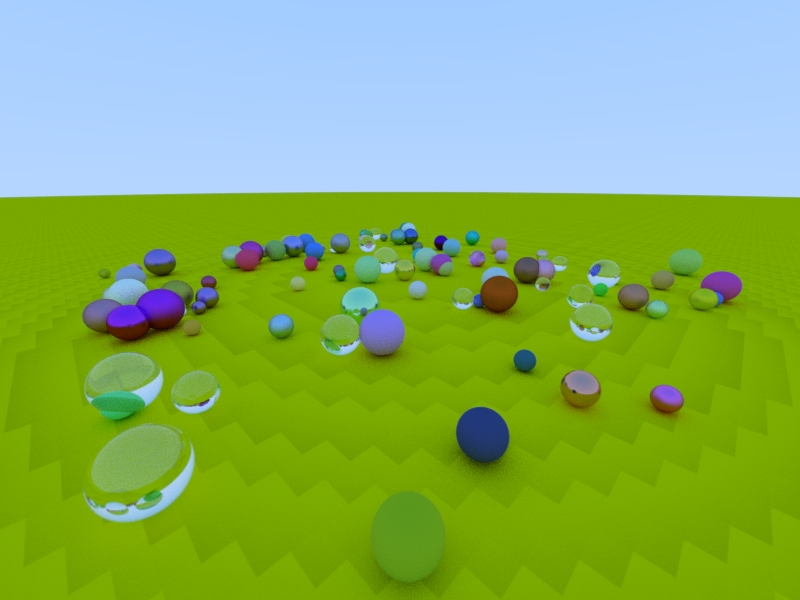
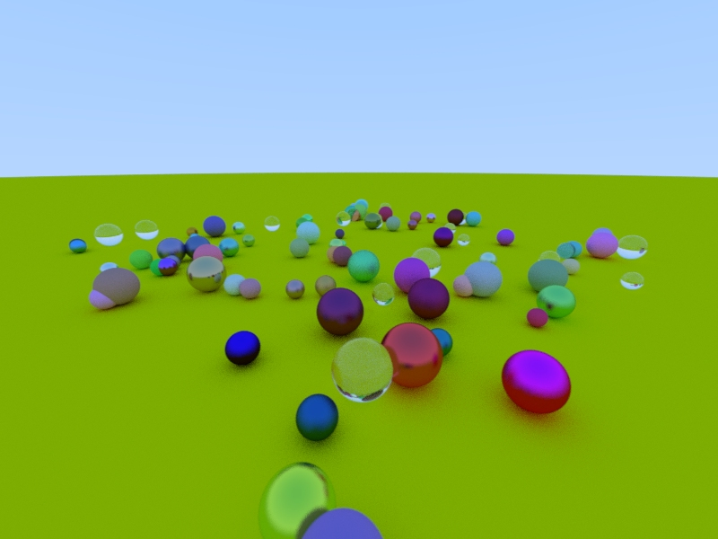

A simple Raytracer written in Haskell. It is mostly the result of transcribing
the Raytracer described in
[Ray Tracing in One Weekend](http://in1weekend.blogspot.de/2016/01/ray-tracing-in-one-weekend.html).

The initial implementation used Float for the points and vectors,
but here I quickly discovered a downside of using this type:

The Same Scene rendered using Double:

I didn't do a thorough benchmark, but just judging from a single run there
doesn't seem to be a big difference.
